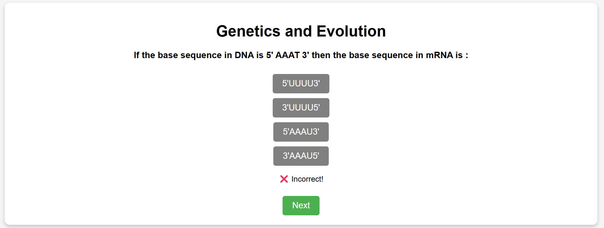
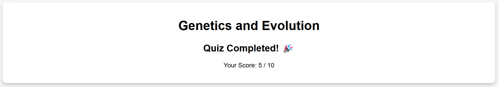

<h1>Quiz Application</h1>

<h2>Overview</h2>

The Quiz Application is a web-based interactive quiz platform that fetches questions from an API and presents them in a clean, user-friendly interface. The app implements gamification features such as scoring, real-time feedback, and a final score display to enhance user engagement. This project is designed using modern JavaScript frameworks and ensures an intuitive quiz-taking experience.

<h2>Features</h2>
<ul>
  <li><strong>Dynamic Quiz Questions:</strong> Fetches quiz questions from an external API dynamically.</li>
  <li><strong>Interactive UI:</strong> Presents questions in a structured format with buttons for selecting answers.</li>
  <li><strong>Score Calculation:</strong> Keeps track of the user’s score and displays it at the end of the quiz.</li>
  <li><strong>Real-time Feedback:</strong> Shows immediate feedback for selected answers, indicating correct or incorrect responses.</li>
  <li><strong>Next Question Navigation:</strong> Users can proceed to the next question only after selecting an answer.</li>
  <li><strong>Completion Summary:</strong> Displays the total score once the quiz is completed.</li>
</ul>

<h2>Technologies Used</h2>
<ul>
  <li>React.js (JavaScript framework for frontend development)</li>
  <li>CSS (for styling and enhancing UI)</li>
  <li>HTML (for structuring content)</li>
  <li>API (to fetch quiz questions dynamically)</li>
</ul>

<h2>Project Structure</h2>
<pre>
Quiz App
├── src/
│   ├── components/
│   │   ├── Quiz.js              - Main quiz component
│   │   ├── Home.js              - Home screen component
│   ├── api/
│   │   ├── fetchQuizData.js      - Fetches quiz data from API
│   ├── styles.css               - Global styles for the app
│   ├── App.js                   - Main application file
│   ├── index.js                 - Entry point of the application
├── public/                      - Static assets
├── README.md                     - Project documentation (this file)
├── package.json                  - Project dependencies and scripts
└── .gitignore                    - Files to be ignored by Git
</pre>

<h2>Installation</h2>

Clone the repository:

<pre><code>git clone https://github.com/HarikaCheruku/Quiz-App.git
cd Quiz-App
</code></pre>

Install dependencies:

<pre><code>npm install</code></pre>

<h2>Usage</h2>

To run the application, use the following command:

<pre><code>npm start</code></pre>

The app will be accessible in your browser at <code>http://localhost:3000</code>.

<h2>API Integration</h2>

The quiz questions are fetched from an external API. The API call is handled in the <code>fetchQuizData.js</code> file, ensuring that questions load dynamically when the quiz starts.

<h2>Customization</h2>
<ul>
  <li>Modify <code>styles.css</code> to update the UI theme.</li>
  <li>Update <code>Quiz.js</code> to add more gamification features like timers, difficulty levels, and leaderboards.</li>
</ul>

<h2>Future Enhancements</h2>
<ul>
  <li>Implement a timer for each question to add challenge.</li>
  <li>Introduce difficulty levels where users can select easy, medium, or hard quizzes.</li>
  <li>Save user progress and allow them to resume later.</li>
  <li>Leaderboard feature to track high scores.</li>
  <li>Mobile-friendly responsive UI.</li>
</ul>
<h2>Application Screenshots</h2>

Quiz in Progress:

Quiz Completed:

<h2>Contributing</h2>

Contributions are welcome! Feel free to open issues, submit pull requests, or suggest improvements. Please ensure your code follows best practices and includes relevant documentation.

